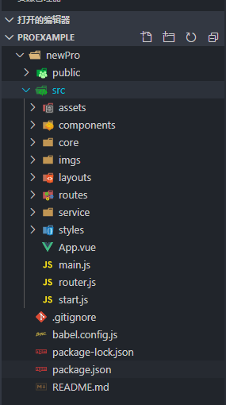
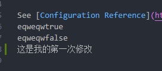
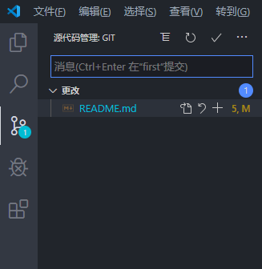
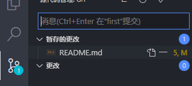
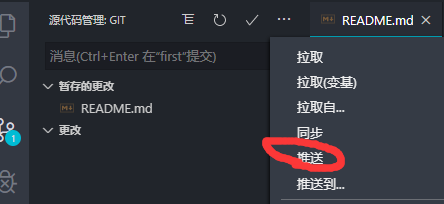
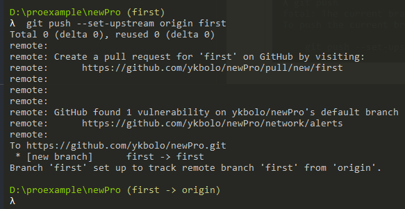

# 使用 git 进行基本的版本控制

## git 的简介

git 是一个分布式的版本控制系统，利用好这个工具能提升开发效率，增加容错率，加强团队协作。

##### 想象一下以下的场景，对于某个项目，需要修改一段代码，有保险意识的同学会把能正常运行的代码进行及时的备份,就需要把项目整个复制一份出来，看着自己的磁盘容量一点点的变满

##### 又或者改着改着，怎么也改不对，不知道如何回到之前的版本。

### git 可以很好的解决以上的痛点，它可以：

- 可以把代码存到远端， 且所需的磁盘空间很少，传输速度快
- 可以把回滚代码，有效降低损失
- 可以多任务并行开发，互不影响
- 利于多人多设备的合作

### 下面介绍一些我常用的操作

#### 克隆一个项目

假设你需要拉去远端的一个项目 new-pro,你需要在本地找到存放的(空)目录
使用`λ git init`命令，来初始化这个目录的 git 环境

可以看到右边括号中有 master 的字样，代表当前处于主分支上
现在，你想把远端的项目克隆到本地来，可以点击复制把这串 url 复制下来

执行`git clone https://github.com/ykbolo/newPro.git`命令，发现如下情况

用`code .`快速打开你的 vscode 编辑器

可以看到远端的项目以及成功的克隆到了你的本地，你的本地仓库也与远端建立了连接，及时重启后再进入这个目录，他们的关联关系也会一直存在

#### 拉取一个分支

假设你有一项开发任务，叫做 first，建议你不要直接再主分支上修改，而是重新拉一个分支
用`git branch`查看本地已存在的分支
用`git checkout -b first`可以以当前分支为基础，拷贝出一个分支，并且切换到该分支上

#### 作出一次提交

加入你相对 readme.md 文件修改一下，保存

在编辑器中可以发现它处于`更改`状态，并没有被 git 所跟踪,可以点击加号让他处于 git 的暂存状态，等同于命令 `git add xxx`

这个时候你想提交这个更改，做为完成一项功能的总结，可以在消息框中输入你对于这次更改的总结，点击 √ 代表把这个 commit 提交到本地的仓库去，等同于命令 `git commit -m 'your description'`

这个时候你想把他提交到远端去，可以打开`...`,选择 push，就可以把你本地的提交推到远程去,

等同于命令 `git push`,但是你会发现没有成功，有如下的代码提示，意思是把本地分支推送到远端分支，并建立关联关系，复制这段代码继续运行一次即可

假设你在别的电脑上进行了提交并推送到远端了，那么你当前的电脑中的代码就不是最新的了，可以用`git pull`拉取远端的代码--(每次开发前，pull 一下是个好习惯噢)

以上最最最基本的 git 命令，掌握这些就可以完成一些基本的操作啦，但是实际开发过程中可能会遇到很多问题，下期会聊一聊一下代码回滚和冲突解决方面的内容
