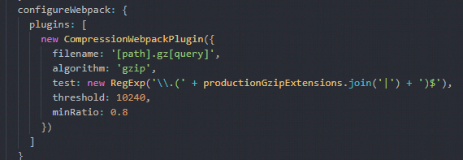
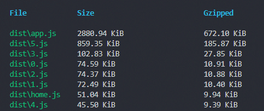
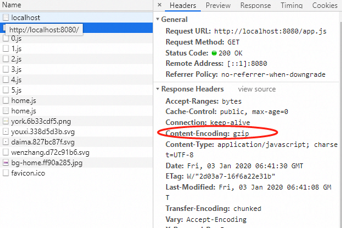

# 为 vue 项目配置 gzip，使用 nginx 配置 gzip

#### **\_**优化网站访问速度(实测无缓存情况下的打开速度由 25s 降低到 6.5s)\_\_\_\_

## 为 vue 的 build 时配置 gzip 压缩

安装 compression 依赖。在根目录下创建的 vue.config.js 会覆盖掉 vue-cli3 中的 config
在 vue.config.js 中导入


在 proxy 下加入以下内容





## 解决 npm run serve 报错的方法


因为在根目录下的 vue.config.js 会覆盖掉默认的配置，packagejson 中的运行脚本并没有设置配置文件，默认取当前根目录下的。
虽然 build 的时候能成功运行，但是调试模式下就会报如上错误
解决方法：
`更名vue.config.js->buildconfig.js`修改运行脚本

```
"serve": "cross-env NODE_ENV=dev vue-cli-service serve",
    "build:dev": "cross-env NODE_ENV=dev vue-cli-service build --buildconfig.js",
    "build:prod": "cross-env NODE_ENV=prod vue-cli-service build --buildconfig.js",
```

这样 run serve 还是走默认配置，run build 则走我配置的 buildconfig.js

## 为 node 服务配置 gzip

在 start.js 上加上如下语句

```
var compression = require('compression')
app.use(compression());
```

用 start.js 本地启动 build 好的服务，发现有了 content-encoding:gzip




但是去服务器上一跑，发现访问速度依旧很慢，content-encoding 也没有改变

## 决定使用 nginx 启动服务的方法试试行不行

用 node 与 nginx 共同搭建一个 web 项目，两者的端口号不能冲突，需要在 nginx 上 node 代理的端口

使用 forever start ./src/start.js 来保持 node 项目的运行，监听端口号 8080
安装 nginx，修改配置文件

##### 关键配置：

- 设置 gzip 为 on ---gzip on;
- 设置代理服务器 ip+端口的形式 --http://127.0.0.1:8080
- 设置 nginx-listen 的端口 80 --http

#### 附上一些配置，仅供参考

#### buildconfig.js build 的配置

```
// 导入compression-webpack-plugin
const CompressionWebpackPlugin = require('compression-webpack-plugin')
// 定义压缩文件类型
const productionGzipExtensions = ['js', 'css']

module.exports = {
  publicPath: '/',//根路径
  outputDir: 'dist',//打包的时候生成的一个文件名
  assetsDir: 'assets',//静态资源目录(js,css,img,fonts)这些文件都可以写里面
  lintOnSave: false,//是否开启eslint保存检测 ,它的有效值为 true || false || 'error'
  devServer: {
    open: true,//启动项目后自动开启浏览器
    host: 'locahost',//对应的主机名
    port: 8080,//端口号
    https: false,//是否开启协议名,如果开启会发出警告
    hotOnly: false,//热模块更新的一种东西,webpack中自动有过配置,但如果我们下载一些新            的模块可以更好的给我更新一些配置
    configureWebpack: {
      plugins: [
        new CompressionWebpackPlugin({
          filename: '[path].gz[query]',
          algorithm: 'gzip',
          test: new RegExp('\\.(' + productionGzipExtensions.join('|') + ')$'),
          threshold: 10240,
          minRatio: 0.8
        })
      ]
    }

  }
};

```

#### package.json 一些运行脚本的配置

```
{
....
"scripts": {
    "serve": "cross-env NODE_ENV=dev vue-cli-service serve",
    "build:dev": "cross-env NODE_ENV=dev vue-cli-service build --buildconfig.js",
    "build:prod": "cross-env NODE_ENV=prod vue-cli-service build --buildconfig.js",
    "lint": "vue-cli-service lint",
    "start:dev": "cross-env NODE_ENV=dev node ./src/start.js",
    "start:prod": "cross-env NODE_ENV=prod forever start ./src/start.js",
    "pydev": "python ./src/main.py",
    "pyprod": "nohup python ./src/main.py &"
  },
  ....
}
```

#### start.js 启动 node 服务的脚本

```
const fs = require('fs');
const path = require('path');
const bodyParser = require('body-parser');
var url = require('url');
const express = require('express');
var querystring = require('querystring');// 引入 querystring 库，也是帮助解析用的
const app = express();
var http = require('http');
var marked = require('marked');
var compression = require('compression')
// node启动时
// let port = process.env.NODE_ENV === "dev" ? '8080' : '80'
// nginx代理启动时
let port = 8080
console.log(process.env.NODE_ENV)
app.use(compression());
app.use(express.static('src'));  //加载静态文件
var urlencodedParser = bodyParser.urlencoded({ extended: false });
.......
app.use(bodyParser.json());
app.use(bodyParser.urlencoded({ extended: false }));
// 服务开启后访问指定编译好的dist文件下的数据
app.use(express.static(path.resolve(__dirname, '../dist')))
app.use(express.static(path.resolve(__dirname, '../public')))
app.get('*', function (req, res) {
  const html = fs.readFileSync(path.resolve(__dirname, '../dist/index.html'), 'utf-8')
  res.send(html)
})
// 后端api路由
// app.use('/api', userApi);
// 监听端口
app.listen(port);
console.log(`success listen at port:${port}......`);
```

#### nginx.conf nginx 配置文件部分参考

```

worker_processes  1;
events {
    worker_connections  1024;
}
....
http {
    include       mime.types;
    default_type  application/octet-stream;
    sendfile        on;
    keepalive_timeout  65;
    gzip  on;
    server {
        listen       80;
        server_name  ezreal-yk.cn;
        #charset koi8-r;
        #access_log  logs/host.access.log  main;
        location / {
            proxy_pass       http://127.0.0.1:8080;               #映射到代理服务器，可以是ip加端口,   或url
            proxy_set_header Host      $host;
            proxy_set_header X-Real-IP $remote_addr;
            proxy_set_header X-Forwarded-For $proxy_add_x_forwarded_for;
       }
       ....
    }
    ....
}
```
